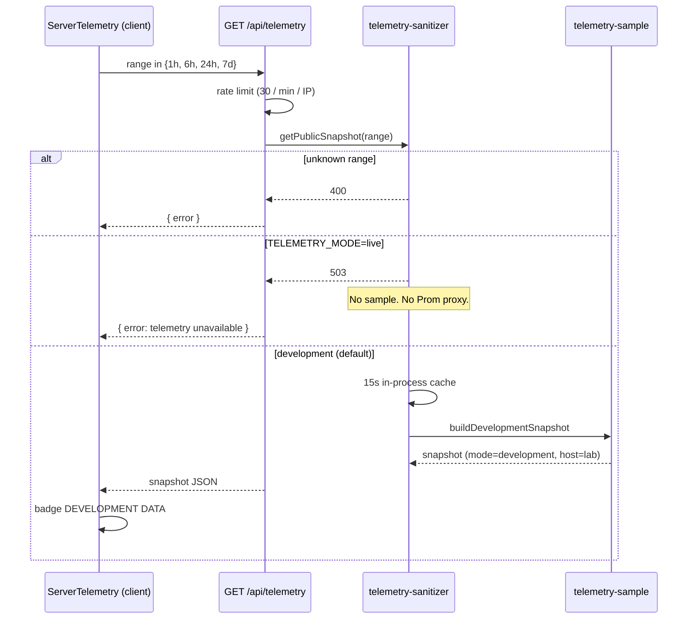

# Personal website

Baris Batur's portfolio: a single-page Next.js app with an instrument-panel visual language. Copy and project facts live in a typed content file. The **Server telemetry** section is a real client/server pipeline with a locked-down public API. It currently serves labelled development series. It is designed so a later live scrape cannot leak PromQL, internal hostnames, or credentials into the browser.

There is no Docker, Compose, or Kubernetes tree in this repo. Production is `next build` + `next start` behind TLS at the edge.

## Contents

- [Stack](#stack)
- [Layout](#layout)
- [Local development](#local-development)
- [Content](#content)
- [Two telemetry surfaces](#two-telemetry-surfaces)
- [Telemetry pipeline](#telemetry-pipeline)
- [Public API](#public-api)
- [Status model](#status-model)
- [Wiring live later](#wiring-live-later)
- [HTTP headers and security](#http-headers-and-security)
- [Environment](#environment)
- [Production](#production)
- [Checks](#checks)

## Stack

| Piece | Version / notes |
| --- | --- |
| Next.js (App Router) | 16.3.3 |
| React | 19 |
| Tailwind CSS | 4 (via `@tailwindcss/postcss`) |
| TypeScript | 5.7.3, `strict` |
| Node | `>=20` (`engines` in `package.json`) |
| Tests | Vitest 4, Node environment |

Install and lockfile: **npm** (`package-lock.json`). A `pnpm-lock.yaml` may also be present; do not mix package managers on the same checkout.

`shadcn` is a **build-time** CSS import (`@import 'shadcn/tailwind.css'` in `app/globals.css`). It is listed under `devDependencies`. `next build` needs it; `next start` of an already-built app does not.

## Layout

```
app/
  page.tsx                 Single route: the whole site
  layout.tsx               Fonts, metadata, optional Vercel Analytics
  error.tsx                Client error UI (no stack traces)
  not-found.tsx            404
  api/telemetry/route.ts   Public telemetry GET
  globals.css              Theme tokens, plate chrome
components/                Section UI (hero, telemetry panel, dossier, …)
lib/
  data.ts                  All visitor-facing copy and project facts
  types.ts                 Content schema
  telemetry.ts             Client-safe types, formatters, fetch helper
  telemetry-sample.ts     server-only sample series
  telemetry-sanitizer.ts   server-only public snapshot gate
  safe-href.ts             https / mailto allowlist
public/                    Favicons (icon.png, icon-32x32.png, apple-icon.png, favicon.ico)
```

There is one user-facing page. Hash links (`#work`, `#telemetry`, `#log`) are in-page, not extra routes.

## Local development

```bash
npm ci
cp .env.example .env.local   # optional; all keys are commented
npm run dev
```

Default URL: [http://localhost:3000](http://localhost:3000).

Hot Module Replacement from another machine on the LAN (phone, another laptop) needs an explicit origin. Next.js does not pick this up from the bind address. In `.env.local`:

```bash
ALLOWED_DEV_ORIGIN=192.168.10.82
```

No protocol, no port. Comma-separated if you need more than one. `next.config.mjs` reads this only for `next dev`.

## Content

Edit **`lib/data.ts`**. The schema is **`lib/types.ts`**. That is the whole CMS: profile, stack, homelab diagram, projects, case files, experience log.

Facts are meant to match CV / LinkedIn / public GitHub. Do not invent production SLOs, traffic, or uptime in this file.

Project links:

- `href`: live site or GitHub
- `sourceHref`: GitHub when `href` is the live site (Hackerspace)
- `playHref`: playable build (Pass the Mask on itch.io)

The dossier (`components/case-file-dossier.tsx`) labels those as visit site / view source / play the game. Only `https:` and `mailto:` URLs are rendered (`lib/safe-href.ts`). The footer uses the same allowlist.

## Two telemetry surfaces

They are easy to mix up. They are not the same system.

| Section | Component | Data |
| --- | --- | --- |
| **Signals** (fig.01) | `components/observability-panel.tsx` | Static arrays in `lib/data.ts` (`latencySeries`, `trafficSeries`, `gauges`). Copy says synthetic. Never hits the network. |
| **Server telemetry** (fig.03) | `components/server-telemetry.tsx` | Browser `fetch` to `GET /api/telemetry`. Sample or (later) sanitised live data. Freshness is labelled. |

If you change one, the other does not follow.

## Telemetry pipeline

The browser never imports the sample generator and never sees Prometheus. `import 'server-only'` on the generator and sanitizer makes a mistaken client import fail the Next.js build.



| File | Bundle | Role |
| --- | --- | --- |
| `lib/telemetry.ts` | Client and server | Metric IDs, range allowlist, formatters, `resolveTelemetryStatus`, `fetchPublicSnapshot` |
| `lib/telemetry-sample.ts` | Server only | Deterministic sample series. Labelled `development`. Public host alias only. |
| `lib/telemetry-sanitizer.ts` | Server only | Allowlists `range`, refuses extra semantics, does not scrape Prom. |
| `app/api/telemetry/route.ts` | Server only | HTTP: rate limit, JSON, cache headers. `dynamic = 'force-dynamic'`. |
| `components/server-telemetry.tsx` | Client | Range/metric UI. Fetches on range change. Never invents a series if the request fails. |

### What the sanitizer will not do

These are load-bearing constraints, not TODOs:

- No PromQL, Grafana Explore URLs, or scrape targets from query string or body. Extra keys (`query`, `url`, `promql`) are ignored.
- No `NEXT_PUBLIC_*` Prometheus URL or token. Anything `NEXT_PUBLIC_` is compiled into the client bundle.
- No forwarding the visitor request to Prometheus, Grafana, or node_exporter.
- No real hostname, OS, or region in the JSON. Public host is `lab`; `os` and `region` are empty strings; adapter is `sanitizer`.
- `TELEMETRY_MODE=live` without a locked-down upstream returns **503**, not sample data labelled `live`.

### Sample generator

`buildDevelopmentSnapshot` uses a seeded PRNG (mulberry32) so a given metric + range is stable enough to look like a chart, not a live scrape. Uptime is a fixed fictional duration. The payload still has `mode: "development"` so the UI cannot honestly show LIVE.

## Public API

There is one JSON endpoint.

```
GET /api/telemetry?range={1h|6h|24h|7d}
```

Same origin only. No CORS headers. The client sends `Accept: application/json` and `cache: 'no-store'`.

### Ranges

| `range` | Points | Step |
| --- | --- | --- |
| `1h` | 60 | 60 s |
| `6h` | 72 | 5 min |
| `24h` | 96 | 15 min |
| `7d` | 84 | 2 h |

Anything else is `400` `{ "error": "invalid range" }`. Missing `range` is invalid.

### Status codes

| Status | When | Body |
| --- | --- | --- |
| `200` | Development snapshot | `TelemetrySnapshot` |
| `400` | `range` not in the allowlist | `{ "error": "invalid range" }` |
| `429` | More than 30 requests / 60 s from the same client key | `{ "error": "rate limited" }`, `Retry-After: 60` |
| `503` | `TELEMETRY_MODE=live`, or an unexpected throw | `{ "error": "telemetry unavailable" }` |

Successful responses set `Cache-Control: private, max-age=15` and `Content-Type: application/json; charset=utf-8`.

### Snapshot shape (200)

```ts
{
  host: { hostname: 'lab', os: '', region: '', uptimeSeconds: number },
  mode: 'development' | 'live',
  freshness: 'ok' | 'stale' | 'unavailable',
  generatedAt: number,          // unix ms
  scrapedAt?: number,          // live only, when wired
  staleAfter?: number,        // live only; default generatedAt + 3 min
  range: '1h' | '6h' | '24h' | '7d',
  adapter: 'sanitizer',
  metrics: {
    cpu: MetricSnapshot,
    memory: MetricSnapshot,
    disk: MetricSnapshot,
    network: MetricSnapshot,
    latency: MetricSnapshot,
    load: MetricSnapshot,
  }
}
```

Each `MetricSnapshot` has `id`, `points: { t, v }[]`, `current`, `min`, `max`, `avg`.

The client re-validates this in `asTelemetrySnapshot` (`lib/telemetry.ts`) before painting. Hostname is truncated to 32 characters. Adapter is truncated to 32 characters and falls back to `sanitizer`.

### Probe examples

```bash
# Default development snapshot
curl -sS 'http://127.0.0.1:3000/api/telemetry?range=1h' | jq '{mode,host,adapter,range}'

# Rejected window
curl -sS -o /dev/null -w '%{http_code}\n' 'http://127.0.0.1:3000/api/telemetry?range=30d'
# 400

# Extra keys must not change behaviour or appear in the body
curl -sS 'http://127.0.0.1:3000/api/telemetry?range=1h&query=up&url=http://127.0.0.1:9090'
```

### Rate limit and cache (process-local)

Both are **in-memory `Map`s on the Node process**.

| Control | Where | Value |
| --- | --- | --- |
| Rate limit | `app/api/telemetry/route.ts` | 30 hits / 60 s per key |
| Snapshot cache | `lib/telemetry-sanitizer.ts` | 15 s per `range` |
| Map cap | rate limiter | clears if more than 10_000 keys |

Client identity is `X-Forwarded-For` (first hop, truncated to 64 chars), else `X-Real-Ip`, else `unknown`.

**Ops implications:**

- Several Node processes (cluster, multiple replicas) each have their own counters and cache. The limit is per replica, not global.
- Restarting the process resets both maps.
- **Only trust `X-Forwarded-For` if a reverse proxy you control overwrites it.** If `next start` is reachable directly, clients can spoof the header and partition the limiter.
- There is no Redis or shared cache. That is intentional for a small public sample API.

`export const dynamic = 'force-dynamic'` stops Next from prerendering a single range at build time.

## Status model

The panel badge is not the same as `TELEMETRY_MODE`. `resolveTelemetryStatus` in `lib/telemetry.ts`:

| Badge | Meaning |
| --- | --- |
| **DEVELOPMENT DATA** | `sourceMode === 'development'` (including a successful sample response). |
| **LIVE** | Live snapshot, `freshness: ok`, inside the stale window, fetch succeeded. |
| **DELAYED** | Live snapshot that is stale, or a failed refetch while a previous live snapshot is still inside the window. Last scrape age is shown. |
| **OFFLINE** | Live source, no usable snapshot: failed fetch with nothing to show, `freshness: unavailable`, or past `staleAfter`. |

`TELEMETRY_STALE_MS` is 3 minutes.

A failed fetch **keeps the last snapshot**. The client does not generate a replacement series. If the first request fails and there is no snapshot, `sourceMode` is set to `live` so the UI shows offline rather than painting fake development charts.

Provenance in the footer uses the public adapter name (`sanitizer`), not an internal job or hostname.

## Wiring live later

Live scrape is **not implemented**. Setting `TELEMETRY_MODE=live` today is a fail-closed switch (503). When you add an upstream, keep the sanitizer as the only module that talks to it:

1. Keep Prom URL, tokens, and query templates in **server env** without `NEXT_PUBLIC_`.
2. Use **fixed PromQL templates** in the sanitizer. Do not concatenate visitor input into queries.
3. Map series into the existing `TelemetrySnapshot` shape. Keep `host.hostname` as `lab` (or another public alias). Strip instance labels.
4. Set `mode: 'live'`, `freshness` from scrape success, `scrapedAt` / `staleAfter` from the scrape clock.
5. On scrape failure, return live + `freshness: 'unavailable'` or HTTP 503. Do **not** return the sample generator labelled as live.
6. Do not add Prometheus to CSP `connect-src`. The browser should still only talk to `/api/telemetry`.

## HTTP headers and security

`next.config.mjs` sets these on `/:path*`:

| Header | Value |
| --- | --- |
| `X-Content-Type-Options` | `nosniff` |
| `Referrer-Policy` | `strict-origin-when-cross-origin` |
| `Strict-Transport-Security` | `max-age=63072000` (browsers ignore HSTS on localhost) |
| `Permissions-Policy` | `camera=(), microphone=(), geolocation=()` |
| `X-Frame-Options` | `DENY` |
| `Cross-Origin-Opener-Policy` | `same-origin` |
| `Cross-Origin-Resource-Policy` | `same-origin` |
| `Content-Security-Policy` | See below |

Also: `poweredByHeader: false`, `productionBrowserSourceMaps: false`. `images.unoptimized: true` (no image optimizer). TypeScript `ignoreBuildErrors` is **not** enabled.

CSP (production): `default-src 'self'`; `script-src` includes `'unsafe-inline'` (hydration) and `https://va.vercel-scripts.com`; `style-src 'self' 'unsafe-inline'` (inline chart colours); `img-src 'self' data: blob:`; `font-src 'self'` (next/font is self-hosted at build); `connect-src 'self'` plus Vercel Analytics hosts; `frame-ancestors 'none'`; `base-uri 'self'`; `form-action 'self'`; `object-src 'none'`; `frame-src 'none'`; `upgrade-insecure-requests` **only when `NODE_ENV !== 'development'`**.

Dev CSP also allows `'unsafe-eval'` and `ws:` / `wss:` for HMR. Headers are evaluated when Next loads `next.config.mjs` (`next build` bakes production CSP into the server).

Error UI (`app/error.tsx`) does not render `error.message` or `error.stack`. `app/not-found.tsx` is a static 404 plate.

`.gitignore` ignores `.env` and `.env.*`, and keeps `.env.example`. Do not commit secrets.

## Environment

All of these are **server-side**. Do not prefix them with `NEXT_PUBLIC_`.

| Variable | Default | Effect |
| --- | --- | --- |
| `TELEMETRY_MODE` | unset = development | `live` → sanitizer returns 503 until an upstream exists |
| `ALLOWED_DEV_ORIGIN` | unset | Comma-separated hosts for `next dev` HMR (no protocol) |
| `DISABLE_ANALYTICS` | unset | `1` skips `@vercel/analytics` in production (recommended on self-host) |
| `NODE_ENV` | set by Next | `production` for `next start` / `next build` |
| `PORT` | 3000 for `next start` | Listen port |

`.env.example` is the commented template. Copy to `.env.local` for local overrides.

Vercel Analytics is included only when `NODE_ENV === 'production'` and `DISABLE_ANALYTICS !== '1'`. It phones home to Vercel. CSP already allows those hosts. Self-host: set `DISABLE_ANALYTICS=1`.

## Production

```bash
npm ci
npm run lint
npm run typecheck
npm test
npm run build
NODE_ENV=production DISABLE_ANALYTICS=1 npm start
```

`next start` is a Node HTTP server. It is not a TLS terminator.

**Put TLS at the reverse proxy or ingress** (Caddy, nginx, Traefik, cloud load balancer). Terminate HTTPS there, set `X-Forwarded-For` / `X-Forwarded-Proto` from the real client, and do not publish port 3000 on the internet.

HSTS in app headers assumes the site is only served on HTTPS in production. If you must serve HTTP on a private network, know that `upgrade-insecure-requests` is in the production CSP.

There is **no `/healthz` route** in this tree. Process supervisors and load balancers can use:

- `GET /` (static HTML, 200 when the app is up)
- `GET /api/telemetry?range=1h` (exercises the sanitizer; 200 in development mode; subject to rate limit)

Do not scrape `/api/telemetry` from a fleet of probes without raising the rate limit or exempting the probe network at the proxy.

`Cross-Origin-Resource-Policy: same-origin` assumes assets and HTML share one origin. A CDN on a different host will need a different CORP story.

## Checks

```bash
npm run lint        # eslint .
npm run typecheck   # tsc --noEmit
npm test            # vitest run
npm run build
```

Tests live next to the modules they cover:

- `lib/telemetry.test.ts` — status resolution never maps a live source to development
- `lib/telemetry-sanitizer.test.ts` — range allowlist, public host alias, extra query keys, rate limit
- `lib/safe-href.test.ts` — `https` / `mailto` only
- `lib/data.test.ts` — project IDs, Hackerspace / Mask / CV-Scanner links

Vitest aliases `server-only` to `test/server-only-stub.ts` because Node has no `react-server` export condition. Next.js still enforces the real package in app builds.

After `next build`, client chunks under `.next/static` must not contain the sample PRNG or internal hostnames. The generator stays on the server.
